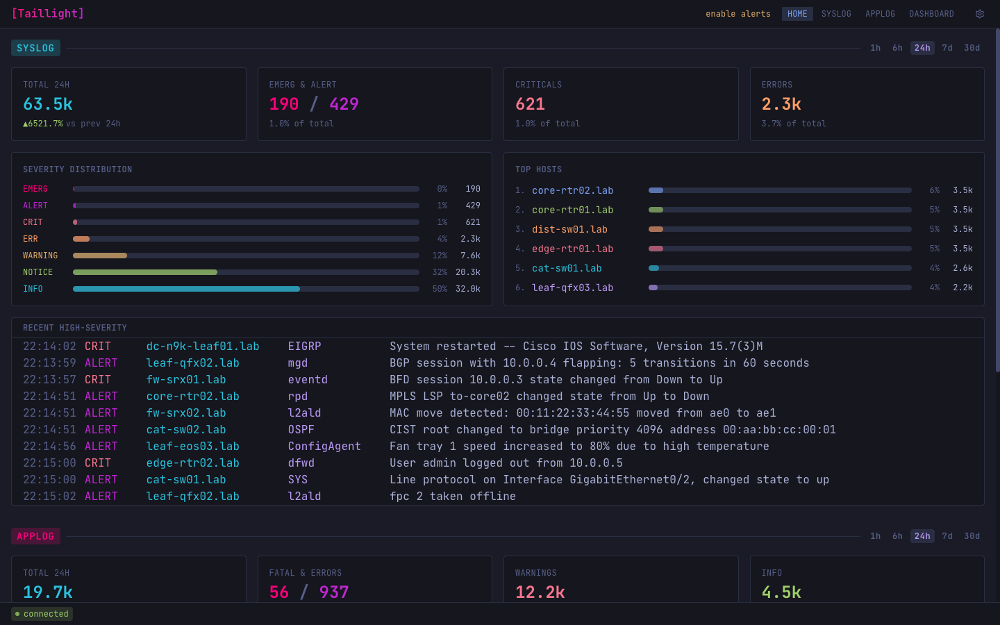
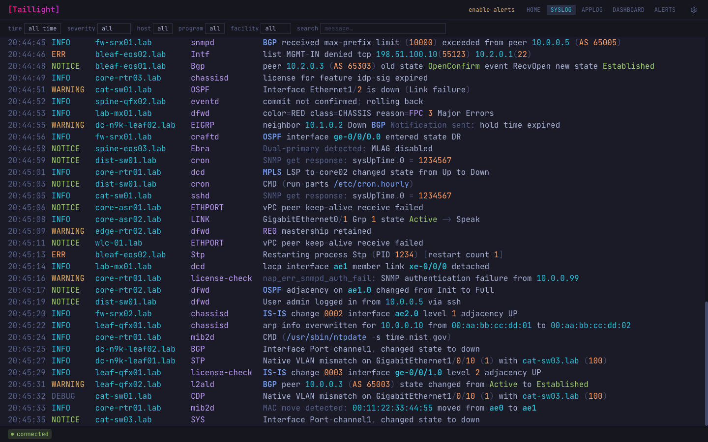
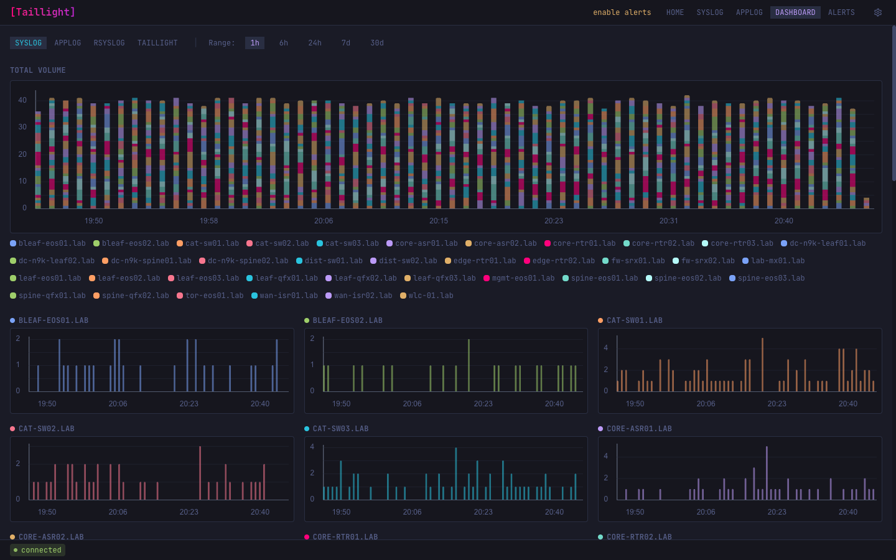

# taillight

[](https://www.gnu.org/licenses/gpl-3.0)
[](https://go.dev)

Lightweight, real-time log viewer for network operations teams. Stream syslog and application logs to your browser — no JVM, no agents, no cluster to manage.







## Why Taillight?

- **Real-time first** — events are pushed to the browser via Server-Sent Events the moment they hit the database. Per-client server-side filtering means you only receive what you asked for.
- **Lightweight stack** — PostgreSQL (TimescaleDB) + a single Go binary + rsyslog. No Elasticsearch, no JVM, no agent fleet to manage.
- **Dual log sources** — network syslog (via rsyslog/ompgsql) and application logs (via HTTP ingest API) share the same streaming, filtering, and dashboards.
- **Built-in alerting** — Slack, email (SMTP), and webhook notification channels with burst detection, cooldown, and rate limiting to prevent alert fatigue.
- **Optional AI analysis** — daily log briefings generated by a local Ollama LLM, surfacing anomalies and trends without sending data off-premise.

## Features

### Streaming & Filtering

- SSE push for syslog and application log events — no polling
- Filter by host, facility, severity, program, service, component, and full-text search
- Cursor-based pagination for historical queries

### Dashboards & Analytics

- Severity breakdown, top hosts, and recent high-severity events at a glance
- Per-host volume charts with selectable time ranges
- Per-device detail views for syslog and application logs
- Continuous aggregates for fast dashboard queries

### Application Log Ingest

- `POST /api/v1/applog/ingest` — structured JSON batch endpoint
- `taillight-shipper` — standalone binary that tails log files and ships them to the ingest API
- `pkg/logshipper` — Go `slog.Handler` for shipping your application's own logs

### Notifications

- Slack, email (SMTP), and webhook backends
- Severity and host/program pattern matching rules
- Burst windows, cooldown anti-spam, and circuit breakers
- Notification log with delivery status tracking

### AI Analysis

- Scheduled daily reports via local Ollama LLM
- Anomaly detection and trend summaries
- On-demand analysis trigger via API

### Operations

- TimescaleDB hypertables with compression and configurable retention policies
- Prometheus metrics (`/metrics` endpoint or dedicated metrics server)
- Session-based auth with API key support (read, ingest, admin scopes)
- Interactive API documentation at `/api/docs` (Scalar/OpenAPI)
- Docker Compose one-command deployment
- Built-in load generators for syslog and application log events
- Juniper syslog reference data import (XLSX)

## Architecture

```
                        ┌──────────────────────────┐
  rsyslog ──ompgsql──►  │    syslog_events         │
                        │    (TimescaleDB)          │
                        └─────────┬────────────────┘
                                  │ pg_notify
                                  ▼
                        ┌──────────────────────────┐
                        │    Go backend             │
                        │    LISTEN/NOTIFY          │──► NotificationEngine
                        │    SyslogBroker fan-out   │    (Slack/Email/Webhook)
                        └─────────┬────────────────┘
                                  │ SSE
                                  ▼
                        ┌──────────────────────────┐
                        │    Browser (EventSource)  │
                        └──────────────────────────┘

  HTTP POST ──────────► applog_events (TimescaleDB)
  (ingest API)                    │ AppLogBroker fan-out ──► SSE
```

The Go backend holds a persistent `LISTEN` connection to PostgreSQL. When a row is inserted, a trigger fires `pg_notify` with the event ID. The backend fetches the full row, applies per-client filters, and pushes matching events to SSE clients. Application logs follow the same fan-out pattern via the HTTP ingest API.

## Quickstart

### Docker Compose

```sh
cp .env.example .env
docker compose up -d
```

This starts TimescaleDB, the API, rsyslog, and the frontend.

| Service    | Host Port | Variable             |
|------------|-----------|----------------------|
| Frontend   | 3000      | `FRONTEND_HOST_PORT` |
| API        | 8080      | `API_HOST_PORT`      |
| PostgreSQL | 5432      | `POSTGRES_HOST_PORT` |
| rsyslog    | 1514      | `RSYSLOG_HOST_PORT`  |

### Create a user

```sh
docker compose exec api /app useradd --username admin --password admin
```

### Generate test data

```sh
# Syslog events (direct SQL insert)
docker compose exec api /app loadgen -n 100 --delay 100ms --jitter 200ms

# Syslog events via rsyslog (full pipeline)
docker compose exec api /app loadgen -n 100 --syslog rsyslog:514 --delay 100ms

# Application log events (HTTP ingest)
docker compose exec api /app applog-loadgen -n 100 --batch 50 \
  --endpoint http://localhost:8080/api/v1/applog/ingest
```

## Log Shipper

**`taillight-shipper`** is a standalone binary that tails log files and pipes stdin, shipping structured log entries to the ingest API. Use it to onboard any application that writes to files or stdout.

**`pkg/logshipper`** is a Go `slog.Handler` — add it to your application to ship logs directly from code without an external process.

See [`cmd/taillight-shipper/`](api/cmd/taillight-shipper/) for configuration and usage.

## Configuration

### `.env` — per-deployment settings

| Variable | Default | Description |
|----------|---------|-------------|
| `POSTGRES_PASSWORD` | `taillight` | Database password |
| `POSTGRES_HOST_PORT` | `5432` | Host port for PostgreSQL |
| `API_HOST_PORT` | `8080` | Host port for the API |
| `RSYSLOG_HOST_PORT` | `1514` | Host port for syslog (`514` in production) |
| `FRONTEND_HOST_PORT` | `3000` | Host port for the web UI |
| `LOG_LEVEL` | `info` | `debug`, `info`, `warn`, `error` |
| `AUTH_ENABLED` | `false` | Enable authentication |
| `API_URL` | *(empty)* | Frontend API URL (empty = same-origin) |

### `api/config.yml` — application tuning

CORS origins, connection pool sizes, retention policies, notification engine, SMTP, and AI analysis. See [`config.yml.example`](api/config.yml.example) for all options.

Environment variables always override config file values (Viper priority: defaults → config.yml → env vars).

## Local Development

**API:**

```sh
cd api
cp config.yml.example config.yml
make build && make test && make lint
```

**Frontend:**

```sh
cd frontend
npm install && npm run dev
```

**CLI commands:**

| Command | Description |
|---------|-------------|
| `serve` | Start the HTTP/SSE server |
| `migrate` | Run database migrations (up/down/version) |
| `loadgen` | Generate syslog test events |
| `applog-loadgen` | Generate application log test events |
| `useradd` | Create a user account |
| `apikey` | Manage API keys |
| `import` | Import Juniper syslog reference data (XLSX) |
| `version` | Print the build version |

## Components

| Directory | Description |
|-----------|-------------|
| `api/` | Go backend (chi router, pgx, SSE, LISTEN/NOTIFY) |
| `frontend/` | Vue 3 SPA (TypeScript, Tailwind CSS) |
| `rsyslog/` | Modular rsyslog filtering config for network devices |
| `api/cmd/taillight-shipper/` | Standalone log file tailer and ingest shipper |
| `api/pkg/logshipper/` | Go `slog.Handler` for programmatic log shipping |
| `docs/` | Architecture, internals, notifications, and deployment guides |

## Documentation

- [Overview](docs/OVERVIEW.md) — features, quickstart, configuration, CLI reference
- [Architecture](docs/ARCHITECTURE.md) — system design, data flow, deployment topology
- [Internals](docs/INTERNALS.md) — SSE brokers, LISTEN/NOTIFY, pagination, auth
- [Notifications](docs/NOTIFICATIONS.md) — notification setup, channels, rules, anti-spam
- [API Reference](api/API.md) — HTTP endpoints
- [Interactive API Docs](http://localhost:8080/api/docs) — Scalar UI (when running locally)
- [rsyslog Config](rsyslog/README.md) — rsyslog deployment and filtering
- [nginx Examples](docs/nginx-reverse-proxy.conf.example) — production reverse proxy config

## Contributing

See [CONTRIBUTING.md](CONTRIBUTING.md) for development setup, commit conventions, and PR guidelines.

## License

This project is licensed under the GNU General Public License v3.0 — see the [LICENSE](LICENSE) file for details.
