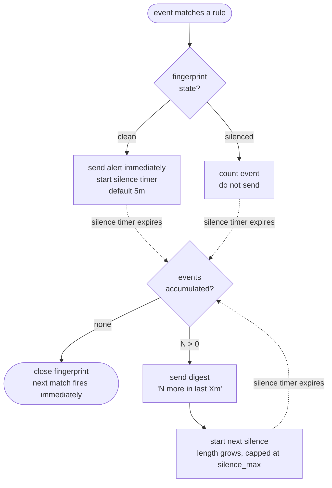

# Notifications

_A guide for operators — what alerts do, how to tune them, and what to expect._

Taillight watches every log event flowing through it (`srvlog`, `netlog`, `applog`) against a set of **rules** you define. When an event matches, Taillight fires an **alert** to one or more **channels** — Slack, a webhook, email, or ntfy.

Alerts are designed for one thing: **tell a human about an important event, fast, without hammering them when the same thing keeps happening.**

That's the whole product. It is not an incident manager, it does not track "resolved" states, and it does not try to be PagerDuty.

---

## How an alert behaves

One sentence: **the first matching event fires immediately; repeats of the same pattern are folded into a single digest at the end of a quiet window.**

Each rule has a _fingerprint_ — the combination of the rule's ID and the `group_by` fields (default: `hostname` for srvlog/netlog, `host` for applog). Each fingerprint goes through this cycle independently:



Three things to internalise:

1. **No ramp-up.** The first event on a clean fingerprint hits your Slack in the same time it takes to render in the Taillight UI. No burst window, no debounce.
2. **No resolved alerts.** Syslog has no concept of recovery — the absence of events isn't a signal. If events stop, the fingerprint simply closes quietly. The next match fires an immediate alert again.
3. **Silence grows, but has a ceiling.** If a rule is genuinely spammy, the silence window lengthens a little each time it triggers (linear bump: 5m → 10m → 15m → 15m, capped). One fully quiet window resets it.

---

## Rules

A rule defines _when_ to fire and _how loud_ to be. Rules live in the `notification_rules` table and are edited in the UI (Notifications → Rules) or via `POST /api/v1/notifications/rules`.

### Matching — "when does this rule care about an event?"

All filters are **AND**-ed. Leave a field blank to mean _any_.

| Field | Event kinds | What it matches |
| --- | --- | --- |
| `event_kind` | — | `srvlog`, `netlog`, or `applog`. Required. |
| `hostname` | srvlog, netlog | Exact or wildcard (`router*`). |
| `programname` | srvlog, netlog | Exact or wildcard. |
| `severity` | srvlog, netlog | Exact syslog severity (0–7). |
| `severity_max` | srvlog, netlog | Maximum severity — `severity_max: 4` matches `warning` and above. |
| `facility` | srvlog, netlog | Exact syslog facility (0–23). |
| `syslogtag` / `msgid` | srvlog, netlog | Exact. |
| `service` / `component` | applog | Exact. |
| `host` | applog | Exact or wildcard. |
| `level` | applog | Minimum level: `WARN` matches `WARN`, `ERROR`, `FATAL`. |
| `search` | all | Case-insensitive substring of the message (or JSON attrs for applog). |

Syslog severity reference: `0 emerg · 1 alert · 2 crit · 3 err · 4 warning · 5 notice · 6 info · 7 debug`.

### Grouping — "what counts as 'the same alarm'?"

`group_by` decides when two matching events are the _same_ fingerprint (and so should be deduplicated) versus two _different_ fingerprints (each fires its own immediate alert).

- Default: `hostname` for srvlog/netlog, `host` for applog. One alarm per host.
- Comma-separated for composite keys: `hostname,programname` means "same host + same program = same alarm".
- Valid fields for srvlog/netlog: `hostname`, `programname`, `syslogtag`, `severity`.
- Valid fields for applog: `host`, `service`, `component`, `level`.

Narrow grouping → more immediate alerts. Wide grouping → more suppression.

### Delivery — "how loud can this rule be?"

| Field | Default | What it controls |
| --- | --- | --- |
| `silence` | `5m` | How long to wait before the _next_ digest after an immediate alert fires. During this window, matching events are counted, not sent. |
| `silence_max` | `15m` | Upper bound on the silence window. If a rule keeps firing digests, each new silence is `previous + rule.silence`, capped here. One quiet window resets the growth. |
| `coalesce` | `0s` | Off by default. Small window (milliseconds) to **batch the very first alert**, so a flood arriving inside the same millisecond becomes one alert with `count=N` instead of one alert plus a digest. |
| `channel_ids` | — | List of channel IDs to deliver to. A rule can fan out to Slack and an internal webhook at once. |
| `enabled` | `true` | On/off switch. |

---

## What arrives in your channel

Two payload shapes.

**Alert** (the immediate send — always the first notification for a fingerprint):

```json
{
  "rule": "Production nginx errors",
  "kind": "alert",
  "count": 1,
  "hostname": "web-03",
  "severity": 3,
  "severity_label": "err",
  "message": "upstream timed out (110: Connection timed out)",
  "timestamp": "2026-04-16T09:12:04Z"
}
```

**Digest** (the end-of-silence summary — only if events kept arriving):

```json
{
  "rule": "Production nginx errors",
  "kind": "digest",
  "count": 142,
  "window_seconds": 300,
  "first": "upstream timed out (110: Connection timed out)",
  "last":  "upstream prematurely closed connection",
  "timestamp": "2026-04-16T09:17:04Z"
}
```

Slack renders these as color-coded Block Kit attachments, email as HTML, ntfy as push notifications, and webhook as the raw JSON above (or a custom Go-template if you supply one). The full JSON is always recorded in **Notifications → Log** for auditing.

---

## Picking good values

Starting points for common rules:

- **Page on anything critical.** `severity_max: 2`, `silence: 5m`, `silence_max: 15m`, `coalesce: 0`. One host going critical → ping immediately. Flood → one alert + capped digest.

- **Error-level routine noise.** `severity_max: 3`, `silence: 15m`, `silence_max: 1h`, `coalesce: 500ms`. Still fires fast, but reasonable spam control for chatty services. The small `coalesce` folds simultaneous bursts into the first alert.

- **Targeted regex / string match.** `search: "panic"`, `group_by: "hostname,programname"`. One alert per host+program combination. Default silence is fine.

- **Network device warnings.** `event_kind: netlog`, `severity_max: 4`, `hostname: "switch-*"`, `silence: 10m`. A flaky switch that reboots twice sends two immediate alerts (different times) plus digests in between.

### Things the system deliberately does not do

- **"Clear" / "resolved" notifications.** Syslog has no concept of recovery. If you want one, derive it out of band (a cronned reachability check that emits its own event will work).
- **Per-severity policies within one rule.** If INFO and ERROR for the same host need different behavior, make two rules.
- **Retention of suppressed events.** A digest shows `count`, `first`, and `last`. The middle events are not replayed — they're in the main Taillight log view already.

---

## Channels

A **channel** is one configured destination. Four backend types. Multiple rules can point to the same channel.

### Slack

Sends to a Slack Incoming Webhook. Color-coded by severity.

```json
{
  "name": "ops-slack",
  "type": "slack",
  "config": { "webhook_url": "https://hooks.slack.com/services/T00/B00/xxx" },
  "enabled": true
}
```

- `webhook_url` must be HTTPS.
- Severity colors: `crit` and above → red · `err` → orange · `warning` → yellow · `notice/info` → green · `debug` → gray. Applog: `FATAL` red · `ERROR` orange · `WARN` yellow · others green.

### Webhook

Generic HTTP POST. Optional headers, optional Go `text/template` payload.

```json
{
  "name": "pagerduty-hook",
  "type": "webhook",
  "config": {
    "url": "https://events.pagerduty.com/v2/enqueue",
    "method": "POST",
    "headers": { "Authorization": "Bearer pdkey123" },
    "template": ""
  },
  "enabled": true
}
```

- `url` must be HTTP or HTTPS. Private-range IPs are blocked (SSRF protection).
- `template` has access to the full payload and a `marshal` function for JSON-safe escaping. Empty = default JSON body.

### Email

HTML email via SMTP. Requires global SMTP settings (see Configuration).

```json
{
  "name": "oncall-email",
  "type": "email",
  "config": {
    "to": ["oncall@example.com"],
    "subject_template": "[ALERT] {{.Rule}} on {{.Hostname}}"
  },
  "enabled": true
}
```

- `to` is a list of RFC 5322 addresses.
- `subject_template` is optional. When empty, the subject is auto-generated as `[Taillight] <host> - <SEVERITY>`.

### ntfy

Push notifications via ntfy.sh or a self-hosted server.

```json
{
  "name": "phone-push",
  "type": "ntfy",
  "config": {
    "server_url": "https://ntfy.sh",
    "topic": "taillight-alerts",
    "priority": "high"
  },
  "enabled": true
}
```

### Per-channel protections (automatic)

- **Rate limit** — token bucket per channel (Slack 1/s burst 3, Webhook and Email 5/s burst 10, ntfy similar). Stops one noisy rule from saturating a channel. Rate-limited alerts are logged with `status=suppressed reason=rate_limit`.
- **Circuit breaker** — after 5 consecutive failures the channel is short-circuited for 60s. Half-opens for a couple of probes, then either closes on success or stays open.
- **Bounded delivery retry** — on failure the worker retries on a `5s → 30s → 2m → 10m` schedule before giving up. Covers brief Slack / webhook hiccups. Retries are in-memory and lost on restart.

### Testing a channel

Every channel has a **Test** button in the UI, and the equivalent API call:

```sh
curl -s -X POST http://localhost:8080/api/v1/notifications/channels/1/test | jq
```

Test sends a synthetic payload, bypassing rules entirely. Use this to debug a Slack URL typo without waiting for a real event.

---

## Configuration

Global defaults live under `notification:` in `config.yml`. SMTP lives under `smtp:`.

```yaml
notification:
  enabled: true
  rule_refresh_interval: 30s      # how often rule/channel changes are picked up
  dispatch_workers: 4             # concurrent send goroutines
  dispatch_buffer: 1024           # internal queue size before drops
  send_timeout: 10s               # per delivery attempt
  default_silence: 5m
  default_silence_max: 15m
  default_coalesce: 0s

smtp:
  host: "smtp.example.com"
  port: 587
  username: "alerts@example.com"
  password: "secret"
  from: "taillight@example.com"
  tls: true
  auth_type: "plain"              # plain | crammd5 | ""
```

Rule-level fields override the `default_*` values. Environment variables follow viper conventions (`NOTIFICATION_DEFAULT_SILENCE=10m`). The email backend is only registered when `smtp.host` is set — leave it empty to disable email channels entirely.

---

## API reference

All notification endpoints live under `/api/v1/notifications/`. Read endpoints (GET) require the `read` scope; write endpoints (POST/PUT/DELETE) require `admin`. The full schema with try-it-out is at [`/api/docs`](http://localhost:8080/api/docs).

### End-to-end example: Slack alerts on any critical syslog

```sh
# 1. Create a channel.
curl -s -X POST http://localhost:8080/api/v1/notifications/channels \
  -H 'Content-Type: application/json' \
  -d '{
    "name": "ops-slack",
    "type": "slack",
    "config": {"webhook_url": "https://hooks.slack.com/services/T00/B00/xxx"},
    "enabled": true
  }' | jq '.data.id'
# → 1

# 2. Validate it.
curl -s -X POST http://localhost:8080/api/v1/notifications/channels/1/test | jq

# 3. Create a rule. Any srvlog severity ≤ 3, grouped by hostname.
curl -s -X POST http://localhost:8080/api/v1/notifications/rules \
  -H 'Content-Type: application/json' \
  -d '{
    "name": "critical-srvlog",
    "enabled": true,
    "event_kind": "srvlog",
    "severity_max": 3,
    "channel_ids": [1],
    "silence": "5m",
    "silence_max": "15m",
    "group_by": "hostname"
  }' | jq
```

Behavior:

1. First err/crit/alert/emerg event on a new host → Slack ping immediately.
2. Additional matches on that host for the next 5 minutes → counted, not sent.
3. At t = 5 min: if any matches accumulated, one digest with `count=N`, and the next silence lengthens to 10 min.
4. After one fully quiet 5-minute (or 10, or 15) window, the host's fingerprint closes. The next match fires immediately.

### Targeted webhook for a specific host group

```sh
curl -s -X POST http://localhost:8080/api/v1/notifications/rules \
  -H 'Content-Type: application/json' \
  -d '{
    "name": "core-router-down",
    "enabled": true,
    "event_kind": "srvlog",
    "hostname": "core-rtr-*",
    "severity_max": 3,
    "search": "down",
    "channel_ids": [2],
    "silence": "10m",
    "coalesce": "500ms"
  }' | jq
```

The `coalesce: 500ms` folds simultaneous link-flap events into one first alert with a real count, rather than one alert + immediate digest.

### Applog errors grouped by host + component

```sh
curl -s -X POST http://localhost:8080/api/v1/notifications/rules \
  -H 'Content-Type: application/json' \
  -d '{
    "name": "payment-api-errors",
    "enabled": true,
    "event_kind": "applog",
    "service": "payment-api",
    "level": "ERROR",
    "channel_ids": [3],
    "silence": "15m",
    "silence_max": "1h",
    "group_by": "host,component"
  }' | jq
```

---

## Observability

If you run Prometheus / Grafana against Taillight, these are the counters that matter:

- `taillight_notif_rules_evaluated_total` — every rule × event check. Proxy for load.
- `taillight_notif_rules_matched_total` — how many of those checks matched.
- `taillight_notif_sent_total{channel_type,status}` — success / failure per backend.
- `taillight_notif_send_attempts_total{outcome}` — distinguishes first-try success from retry-success and retry-exhausted.
- `taillight_notif_suppressed_total{reason}` — dropped by rate limit, circuit breaker, or a full in-memory dispatch queue.
- `taillight_notif_fingerprints_dropped_total` — hit the 10 000-fingerprints-per-rule cap. Almost always means a too-wide `group_by` (e.g. grouping by a unique ID). Narrow the grouping.

The **Notifications → Log** UI shows the same data per-send, with the rendered payload — useful when an alert "didn't arrive" and you need to confirm whether it was suppressed, sent, or failed.

---

## Troubleshooting

### Notifications not sending

1. **Check the master switch.** `notification.enabled: true` in `config.yml`. When disabled the engine does not start.
2. **Test the channel.** `POST /api/v1/notifications/channels/{id}/test` — if this fails, the channel config is wrong (webhook URL, SMTP, etc.).
3. **Check the rule is enabled.** Rules have their own `enabled` flag.
4. **Check the log.** `GET /api/v1/notifications/log?status=failed` surfaces failed delivery rows with error text.
5. **Mind the refresh interval.** After creating or updating a rule via the API, it takes up to `rule_refresh_interval` (default 30 s) for the engine to pick up the change.

### Too many alerts

- **Widen `silence`.** Longer silence = fewer digests. 15–30 min is often a good fit for chatty services.
- **Widen `group_by`.** Grouping by `hostname` alone creates one fingerprint per host; `hostname,programname` creates more. Fewer groups = fewer parallel alert streams.
- **Add `coalesce`.** A `500ms`–`2s` coalesce turns an immediate + immediate-digest pair into one alert with an accurate count.

### Not enough alerts (digests silent when you expect them)

- **A digest fires only if events accumulated during silence.** Zero events in the window → no digest, fingerprint closes, next event is immediate. This is working as designed.
- **Fingerprint cap.** If `fingerprints_dropped_total` is climbing, the rule's `group_by` is too specific (e.g. includes a request ID). Unique groups pile up to 10 000 per rule, then new ones are dropped. Narrow the grouping.

### Quick symptom table

| Symptom | Most likely cause |
| --- | --- |
| First alert takes 30 s | You're on a pre-redesign build. The new engine has no burst window. |
| Slack gets 1 alert, then nothing for an hour | Pre-redesign cooldown doubling. On the new engine, check `silence_max`. |
| Same event spamming every 5 minutes forever | `silence_max` is too low; widen it or the rule really is firing every window (tighten the filter). |
| Digest shows `count=1` | Exactly one event arrived during silence. Not a bug. |
| `notification_log` shows `attempt=1 failed`, `attempt=2 sent` | Normal retry — the first delivery failed, the second succeeded within backoff. |
| SMTP connection refused | `smtp.host` / `smtp.port` unreachable from the Taillight server. |
| SMTP TLS errors | Server doesn't support STARTTLS — set `smtp.tls: false`. Self-signed certs are rejected; use a real CA. |
| SMTP auth failures | Try switching `smtp.auth_type` to `plain`, `crammd5`, or `""` per your provider's requirements. |

### Slow dispatch / backed-up queue

- **Increase `dispatch_workers`** from the default 4 (try 8–16 if you have many channels).
- **Check for circuit breaker events** in the logs — a dead backend keeps workers bouncing off the retry schedule.
- **Lower `send_timeout`** (e.g. 5s) if a backend is hanging; frees workers faster.
- **Watch `dispatch_buffer`**. If you see "dispatch queue full" warnings, increase the buffer.
